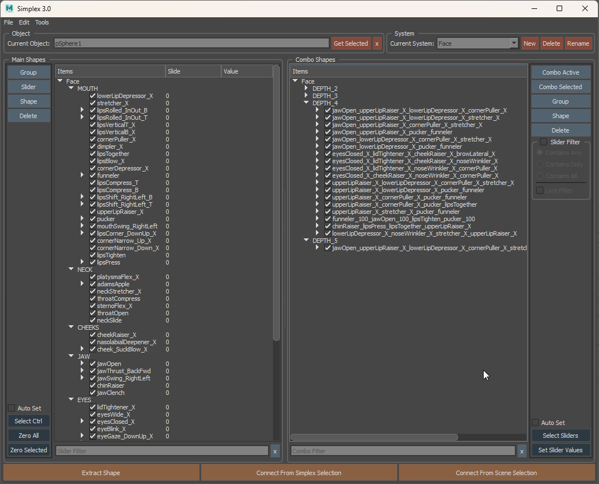

# SIMPLEX UI
---



---

### For Artitsts

Simplex aims to provide an intuitive, cross-package UI that allows for building, editing, and controlling complex shapes, combos, and transitions for use in high-end blendshape facial rigs, or even PSD systems.

This tool was built with the full **F**acial **A**ction **C**oding **S**ystem (FACS) in mind. As such, it easily handles hundreds of shapes with arbitrary combo depth. Spline interpolation for in-between shapes, positive-negative shapes, in-between combo shapes, and combo transitions are supported. Arbitrary value combinations are also fully supported (eg. ComboX activates when SliderA is at 0.25 and SliderB is at 0.33).

### For TD's

Simplex aims to be fully scriptable so that it can easily be inserted into any pipeline. The UI and API are fully Python, all content creation commands are abstracted (for multi-package use), and all systems are built as human readable JSON strings.

There is a suite of tools included that allow for manipulating .smpx files. Most of which can be run completely outside of a DCC. This includes vertex reordering, un-subdividing, splitting, and even shape-inversion. These .smpx files are nothing more than specially structured alembic caches

As long as your package supports Plugins, Python, and Qt (or PySide), you can use Simplex.

#### Simplex is NOT

* Simplex is not a modeling toolkit
    * Modeling is done using whatever tools you choose on your current package
* Simplex is not a deformer
    * It only informs a native blendshape deformer what values the current shapes should have
    * In the future, I *do* have ideas for building an interface to an advanced deformer for dynamically previewing arbitrary splits, but the final output will always have the ability to bake down to a basic blendshape.

### Basic Usage
Follow this youtube link to a basic walkthrough of Simplex usage. This video highlights a slightly older version of Simplex, but the interaction remains basically the same. [https://www.youtube.com/watch?v=LQwzsxU8z_Q](https://www.youtube.com/watch?v=LQwzsxU8z_Q)


## Easy Installation
1. Download [this file](https://raw.githubusercontent.com/blurstudio/Simplex/master/simplex_maya_installer.py) to your computer. Make sure it's saved as a python file.
2. Drag/drop the python file into a freshly opened instance of Maya (make sure all other mayas are closed). A command prompt window may open for a couple seconds. This is normal.
3. If you have multiple Maya versions installed, repeat step 2 for those versions as well. This just ensures that numpy is installed for those versions.
4. Create a python shelf button with this script.
```python
from simplexui import runSimplexUI
runSimplexUI()
```

## Updating
1. Download [this file](https://raw.githubusercontent.com/blurstudio/Simplex/master/simplex_maya_installer.py) to your computer. Make sure it's saved as a python file.
2. Drag/drop the python file into a freshly opened instance of Maya (make sure all other mayas are closed). A command prompt window may open for a couple seconds. This is normal.
3. If you have multiple Maya versions installed, you do NOT have to repeat step 2 for all of them.


## Manual Installation
1. Download the `simplex-v*.*.*.zip` file from the [latest release](https://github.com/blurstudio/Simplex/releases/latest)
2. Create a `modules` folder in your maya user directory. For example, on Windows, that would mean creating `C:\Users\<your-username>\Documents\maya\modules`
3. Copy the `simplex.mod` file and the `simplex` folder into that directory.
4. Install numpy for mayapy [using pip](https://knowledge.autodesk.com/support/maya/learn-explore/caas/CloudHelp/cloudhelp/2022/ENU/Maya-Scripting/files/GUID-72A245EC-CDB4-46AB-BEE0-4BBBF9791627-htm.html). For example, on Windows, once you're in the right place the command will be `mayapy -m pip install numpy`.  You will need admin privelages for this.
5. Run these two Python commands in Maya to start the tool. (This is probably what you should put into a shelf button)
```python
from simplexui import runSimplexUI
runSimplexUI()
```

## Uninstalling
1. Delete the `simplex.mod` file and the `simplex` folder from the `modules` folder in your maya user directory. For example, on Windows, that would mean deleting `C:\Users\<your-username>\Documents\maya\modules\simplex.mod` and `C:\Users\<your-username>\Documents\maya\modules\simplex`


## Compiling
Hopefully you don't need to do this, but if you have to, just take a look at `.github/workflows/main.yml` and you should be able to piece together how to get a compile working using CMake. You aren't required to download the devkit or set its path for CMake if you've got maya installed on your machine. Also note, I use features from CMake 3.16+ so I can target python 2 and 3 separately.
