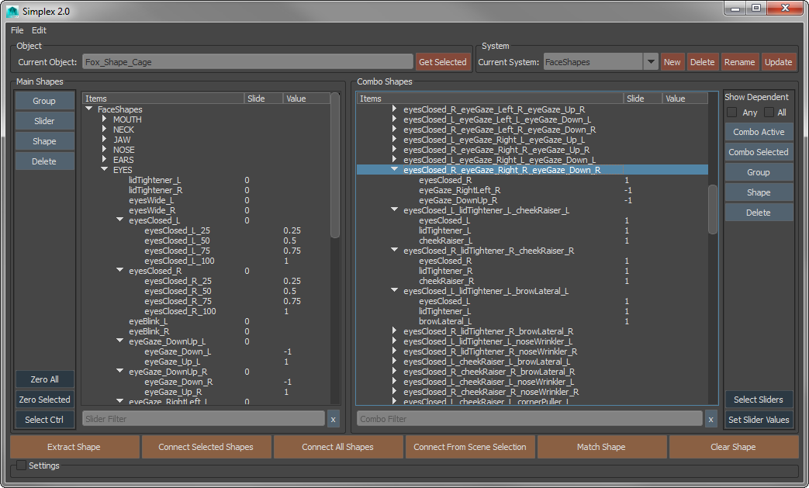

# SIMPLEX SOLVER

---


The Simplex Solver is cross-package plugin and tool for dealing with complex blendshape combos in for high-end facial rigs.

---

### For Artitsts

Simplex aims to provide an intuitive, cross-package UI that allows for full control over shapes, combos, and transitions.

This tool was built with the full **F**acial **A**ction **C**oding **S**ystem (FACS) in mind. As such, it handles hundreds of shapes with arbitrary combo depth, and allows for arbitrary grouping of shapes.

Spline interpolation for in-between shapes, positive-negative shapes, and in-between combo shapes are supported. Arbitrary value combinations are also fully supported (eg. ComboX activates when SliderA is at 0.25 and SliderB is at 0.33).

### For developers

Simplex aims to be fully scriptable so that it can easily be inserted into any pipeline. The UI and API are fully Python, all content creation commands are abstracted (for multi-package use), and all systems are built as human readable JSON strings.

There is a python interface to the simplex solver as well

As long as your package supports Plugins, Python, and Qt (or PySide), Simplex can be built for it.

#### Simplex is NOT

* Simplex is not a modeling toolkit
    * Modeling is done using whatever tools you choose on your current package
* Simplex is not a deformer
    * It only informs a native blendshape deformer what values the current shapes should have

### Documentation

Check out the wiki for documentation and usage. We are still in the process of writing it, so please be patient.

## INSTALLATION

* I haven't had to deal with actually distributing a plugin and tool before, so this may be a little rough
* Most of the development we are currently doing is in Windows, so all instructions will be given assuming that platform.

1. Download the latest release and unzip the folder where you want Simplex to live
2. Open "simplex.mod" and replace all instances of `<FILEPATH>` with the path to your "Simplex" top level folder
3. Copy "simplex.mod" to `%USERPROFILE%\Documents\maya\2016\modules` (or the 2017 folder if you're using 2017)
4. Restart Maya
5. Load the simplex_maya.mll plugin from the plugin manager and run these two commands in Python to start the tool

```python
from SimplexUI import runSimplexUI
runSimplexUI()
```

## BUILD

1. Get all the prerequisites:
    * Get and install the devkit:
        1. Download the maya devkit zip file from their website
        2. Unzip somewhere
        3. Look for the folders: cmake, devkit, include, mkspecs
        4. Copy/merge those folders directly into your maya install directory
    * Get and install Visual Studio 2013. (The Express and Community editions are free online)
    * Get and install CMake from https://cmake.org/download/
2. Navigate to the SimplexCPP folder and make an empty folder inside called "build".
3. Open a command prompt and navigate to this newly created folder
4. Run These two commands, substituting your maya version number after `-DMAYA_VERSION=`

        cmake -G "Visual Studio 12 2013 Win64" -DMAYA_VERSION=2016 ../
        cmake --build . --config Release --target Install

5. If there are no errors, then there should now be a folder in the top-level folder called `maya2016` that contains the plugin


